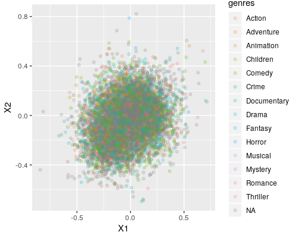

---
output:
  pdf_document: default
  html_document: default
---
Movielens Final Project
================
Sean Coursey
2/6/2022

## Introduction

This project was completed for the *Data Science: Capstone* course in
HarvardX’s *Data Science Professional Certificate* program on edX. The
general goal of this project was to use a dataset of ten million movie
ratings to create a model which could predict, significantly better than
chance, what rating any particular user would give any particular movie.
The publicly available dataset was curated by GroupLens, which is a
computer science research lab at the University of Minnesota, Twin
Cities. The data comes from their movielens project–which is an online,
non-commercial movie recommendation system–and includes ratings from
users who have rated at least 20 movies. For this project, HarvardX
provided code for producing a training set of approximately nine million
observations and a validation set of approximately one million, and the
specific goal of the project was to create a model using the training
set which could predict the ratings in the validation set with a root
mean squared error (or rmse) of less than 0.8649. The model described in
this report achieved an rmse of 0.794 by centering the data, accounting
for the average ratings of each user and of each movie, then accounting
for the remaining variation using matrix factorization (enabled by the
library *recosystem*).

## Methods

The following libraries were used in this analysis:

``` r
library(tidyverse)
library(caret)
library(data.table)
library(recosystem)
library(Metrics)
```

Firstly, the code provided by HarvardX was used to download the data
from GroupLens and partition it into training and validation data
tables–named `edx` and `validation`, respectively. Each observation in
these data sets includes six variables:

``` r
edx[42]
```

    ##    userId movieId rating  timestamp           title   genres
    ## 1:      8      70      5 1111545880 Sleepers (1996) Thriller

For the purpose of matrix factorization, the `timestamp`, `title`, and
`genres` metadata are not helpful, so they were removed from the `edx`
and `validation` data tables–leaving only `userId`, `movieId`, and
`rating`. The `title` and `genres` metadata for each movie
identification number were saved in a data table for later use in
interpretting the result of the matrix factorization. The edx table was
further partitioned into a training set (`train`) and a testing set
(`test`) so a model could be created and tested without using the
validation set.

Before proceeding to factorization, the data in the `train` set was
centered by subtracting the overall average rating, and then each row
was centered by `userId` and by `movieId`. To accomplish this centering,
and for later use in creating the final model, lookup functions
`userAvgRatLookup` and `movieAvgRatLookup` were defined for getting the
average rating for each user and each movie. The average rating for a
movie could be interpreted as its general level of quality while the
average rating for a user could be interpreted as their general
disposition. There is a strong case for these factors of general movie
quality and user disposition being important, considering they account
for approximately 20 percent and 16 percent of the variation in the
data, respectively, when analyzed indepedently and 32 percent when
analyzed concurrently.

``` r
# Centering Data
average = mean(train$rating)
train <- train %>% mutate(delta = rating - average)

# Centering rows using average user rating #
userCentered <- train %>% mutate(delta = delta - userAvgRatLookup(userId))

# Centering rows using average movie rating #
movieCentered <- train %>% mutate(delta = delta - movieAvgRatLookup(movieId))
```

``` r
# Calculating percent variance explained independently #
percent_variance_user <- (var(train$delta) - var(userCentered$delta))/var(train$delta)*100
percent_variance_movie <- (var(train$delta) - var(movieCentered$delta))/var(train$delta)*100
```
    ## [1] 16.4048488
    ## [1] 20.4554471

``` r
old_variance <- var(train$delta)

# Centering rows using both average movie and average user rating #
train <- train %>% mutate(delta = movieCentered$delta + userCentered$delta - delta)
```
```r
# Calculating percent variance explained together #
percent_variance_usermovie <- (old_variance - var(train$delta))/old_variance*100
```
    ## [1] 32.2695636

Now the data was ready for factorization. Passing the data into a
recosystem format and using the `r$tune` and `r$train` functions produced a
factorized model `r`. When tuning, a range of values were used for the
number of factors, L2 loss, and learning rate, with the other values
held constant. The upper limit on the number of factors was decided
considering the computation time it would take to try larger values, and
L1 loss was ignored because of its propensity for overfitting. Also, L2
loss minimizes the sum of squares while L1 loss minimizes linearly, and
the overall goal of the project was to minimize squared error. To be sure
the model was effective and not overfitted, it was applied to the `test` set
and produced a satisfactory rmse of 0.795.

``` r
# Using recosystem model to predict test set #
testReco <- data_memory(test$userId, test$movieId, index1 = TRUE)
testDeltPred <- r$predict(testReco, out_memory())
testRatPred <- testDeltPred + userAvgRatLookup(test$userId) +
               movieAvgRatLookup(test$movieId) + average
```

``` r
# Getting initial rmse from test set: ~0.795 #
rmse(test$rating, testRatPred)
```

    ## [1] 0.7950208

## Results

After determining the model as satisfactory, the factors were analyzed
independently, cumulatively, and dependently for the percent variance
they explained of `train$delta`. Cumulatively, the factors explained about
30 percent of the remaining variation in the `train` data. The two most
important factors were used to make a plot of the movies–colored by genre:

<!-- -->

Unfortunately, the factors did not produce an easily interpretable graph;
there are no discernable discrete groups in the movies. Interestingly,
there was not even a visible correlation between any of the genres and
the scores on any of the factors. A t-sne plot (which is designed to
highlight grouping characteristics in many-dimensional data) using all
thirty factors also did not produce any discernable structure. It appears
that the movies were continuously spread out for each factor.
Interpretation by inspection of the movies ordered by the most important
factor also provided no insight–whatever patterns the factorization was
describing were inscrutable to this author.

Finally, the model was applied to the validation set, producing an rmse
of 0.794.

``` r
# Initial rmse was satisfactory, moving on to validation set #
validationReco <- data_memory(validation$userId, validation$movieId, index1 = TRUE)
validationDeltPred <- r$predict(validationReco, out_memory())
validationRatPred <- validationDeltPred + userAvgRatLookup(validation$userId) +
                     movieAvgRatLookup(validation$movieId) + average
```

``` r
# Getting validation rmse: 0.794 #
# NOTE: Some randomness is involved in the training process due to
# multi-threading, so the exact value varies slightly.
rmse(validation$rating, validationRatPred)
```

    ## [1] 0.7938761

The model is successful, consistently producing an rmse below
0.8–significantly below the goal of 0.865.

## Conclusion

The model described in this report successfully predicts movie ratings
in the 10M MovieLens dataset with an rmse below 0.865 by accounting for
the general quality of the movie, the base disposition of the user, and
then using thirty factors to account for interactions between the
movie’s attributes and the user’s preferences. The main strength of
this model is its accuracy, while its main drawback is how resistent it
is to interpretation. Because the goal of this project was accuracy,
this model is a success; however, it does not shine almost any light on
the structure of the data it predicts. The only easily interpretable
part of the model is that the general quality of each movie and the base
disposition of each user are extremely important–explaining 32 percent
of the variance. The best interpretation this author can make of the
matrix factorization is that the movies in this dataset come in a
continuous variety, without particular useful or meaningful groupings.
More effort in analyzing the most important factors could perhaps lead
to a recognition of what patterns the machine-learning was latching on
to, but initial attempts have not been illuminating. This author remains
unconvinced that there are not meaninful groupings to be found within
the data, and perhaps a future analysis, using a k-nearest-neighbors
approach to group movies and users combined with a model for the
interactions between those groups, could provide predictions while also
highlighting interpretable structure in the data.
